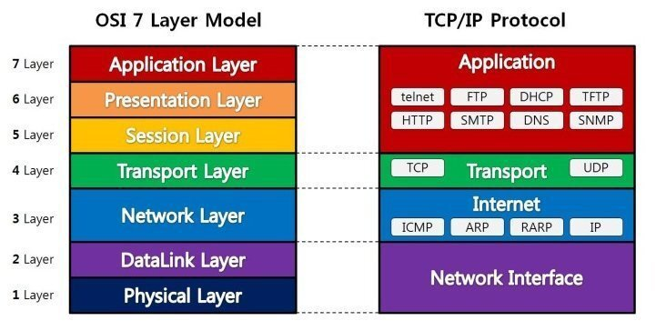

# OSI 7 계층

네트워크에서 통신이 일어나는 과정을 7단계로 나눈 것

## 왜?

통신이 일어나는 과정을 단계별로 파악
흐름을 한눈에 알아보기 쉽고, 7단계 중 특정 단계에 이상이 생기면 다른 단계의 장비 및 소프트웨어를 건들이지 않고 이상이 생긴 단계만 수정 가능

## OSI 7 계층 단계

### 1계층 물리계층(Physical Layer)

- 전기적, 기계적, 기능적 특성을 이용해서 통신 케이블로 데이터 전송
- 주로 사용되는 통신 단위는 비트이며, 이것은 1과 0으로 나타내어지는 전기적으로 On,Off 상태
- 데이터만 전달, 데이터의 내용이나 에러는 신경 쓰지 않음
- 통신케이블, 리피터, 허브 등이 포함

>케이블, 리피터, 허브등을 통한 데이터 전송

### 2계층 데이터 링크계층(DataLink Layer)

- 물리계층을 통해 송수신되는 정보의 오류와 흐름을 관리하여 안전한 정보의 전달을 수행할 수 있도록 도와주는 역할
- 오류도 찾아주고 재전송도 하는 기능
- MAC 주소를 가지고 통신(물리적 주소) : 네트워크 카드가 만들어 질 때 정의
- 이 계층에서 전송되는 단위를 프레임
- 브릿지, 스위치 등이 포함

>프레임에 주소부여(MAC - 물리적주소)
>에러검출/재전송/흐름제어

### 3계층 네트워크 계층(Network Layer)

- 데이터를 목적지까지 가장 안전하고 빠르게 전달(라우팅)
- 사용되는 프로토콜, 라우팅의 종류가 다양
- 경로를 선택하고 주소를 정하고 경로에 따라 패킷을 전달
- 여러개의 노드를 거칠때마다 경로를 찾아주는 역할을 하는 계층
- 다양한 길이의 데이터를 네트워크를 통해 전달하고, 그 과정에서 전송 계층이 요구하는 서비스 품질(QoS)를 제공하기 위한 기능적, 절차적 수단 제공
- 라우팅, 흐름 제어, 세그멘테이션, 오류 제어, 인터네트워킹등을 수행
- 데이터를 연결하는 다른 네트워크를 통해 전달함으로써 인터넷이 가능하게 만드는 계층
- 서브넷의 최상위 계층으로 경로를 설정, 청구 정보를 관리, 개방형 시스템들의 사이에서 네트워크 연결을 설정, 유지, 해제하는 기능을 부여하고, 전송 계층 사이에 네트워크 서비스 데이터 유닛을 교환하는 기능을 제공

> 주소부여(IP), 경로설정(Route)

#### 3.1 IP계층

- TCP/IP 상에서 IP계층이라는 네트워크 주소를 정의하고, IP패킷의 전달 및 라우팅을 담당하는 계층

- OSI 7계층모델의 관점에서 IP계층은 네트워크 계층에 해당
- 패킷을 목적지까지 전달하는 역할 및 그에 수반되는 기타 역할

IP 계층의 주요 역할

- IP 계층에서는 그 하위계층인 데이터링크 계층의 하드웨어적인 특성에 관계없이 독립적 역할 수행

IP 계층 상에 있는 주요 프로토콜

- 패킷의 전달을 책임지는 IP

- 패킷 전달 에러의 보고 및 진단을 위한 ICMP

- 복잡한 네트워크에서 인터네트워킹을 위한 경로를 찾게해주는 라우팅 프로토콜

#### 3.2 IP프로토콜

- TCP/IP 기반의 인터넷 망을 통하여 데이타그램의 전달을 담당하는 프로토콜

1. 주요 기능

- IP 계층에서 IP 패킷의 라우팅 대상이 됨 (Routing)

- IP 주소 지정 (Addressing)

2. 특징

- `신뢰성(에러제어)` 및 `흐름제어`  기능이 전혀 없음  ☞ Best-Effort Service

- 한편, 신뢰성을 확보하려면 IP 계층 위의 TCP와 같은 상위 트랜스포트 계층에 의존

- 비연결성 데이터그램 방식으로 전달되는 프로토콜        ☞ Connectionless

- 패킷의 완전한 전달(소실,중복,지연,순서바뀜 등이 없게함)을 보장 않음  ☞ Unreliable

- IP 패킷 헤더 내 수신 및 발신 주소를 포함  ☞ IPv4 헤더, IPv6 헤더, IP 주소

- IP 헤더 내 바이트 전달 순서 : 최상위 바이트(MSB)를 먼저 보냄  ☞ Big-endian

- 경우에따라, 단편화가 필요함  ☞ IP 단편화 참조

- TCP, UDP, ICMP, IGMP 등이 IP 데이타그램에 실려서 전송

### 4계층 - 전송 계층(Transport Layer)

- 통신을 활성화
- TCP프로토콜 사용, 포트를 열어 응용프로그램들이 전송가능 하도록
- 데이터가 왔다면, 4계층에서 데이터를 합쳐 5계층으로 전달
- 단대단 오류제어 및 흐름제어 물리적 계층에 속함(TCP/UDP 프로토콜 사용)

