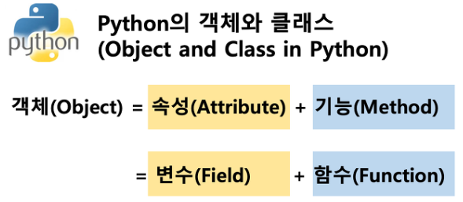

# OOP 객체지향프로그래밍
컴퓨터 프로그램을 명령어의 목록으로 보는 시각에서 벗어나 여러 개의 독립된 단위, 객체들의 모임으로 파악하고자 하는 것, 객체는 메시지를 주고 받고, 데이터를 처리할 수 있다.
프로그램을 여러개의 독립된 객체들과 객체 간의 상호작용으로 파악하는 프로그래밍 방법
## 핵심
- [추상화](#) : 복잡한 것은 숨기고, 필요한 것만 나타냄
- [상속](#상속-inheritance) : Parent class - child class, methods의 재사용
- 다형성 : 이름은 같은데, 동작은 다른 것 ->오버라이딩
- 캡슐화 : 민감한 정보를 숨기는 것 -> getter, setter
## 장점     
- 클래스 단위로 모듈화 => 많은 인원 대규모 소프트웨어 개발
- 필요한 부분만 수정하기 쉽다
## 단점
- 설계시 많은 노력과 시간
    - 다양한 객체들의 상호작용 구조를 만들기 위해 많은 시간과 노력 필요
- 실행 속도가 상대적으로 느림
    - 절차 지향이 컴퓨터의 처리구조와 비슷
## 객체 (컴퓨터 과학)

- 객체 or 오브젝트는 클래스에서 정의한 것을 토대로 메모리에 할당된 것으로 프로그램에서 사용되는 데이터 또는 식별자에 의해 참조되는 공간을 의미하며, 변수, 자료구조, 함수 또는 메서드가 될 수 있다.
- 클래스 = 타입, 객체 = 실제 함수
- 파이썬은 모든 것이 객체 파이썬의 모든 것에는 속성과 행동이 존재
- `list.sort()` 객체.행동() `'banana'.upper()`
- 객체는 특정 타입의 인스턴스 이다.
### 객체의 특징
- 타입(type) : 어떤 연산자(operator)와 조작(method)이 가능한가?
- 속성(attribute) : 어떤 상태(data)를 가지는가?
- 조작법(method) : 어떤 행위(function)을 할 수 있는가?
- object = attribute + method
- 객체는 정보+행동,정보 = 인스턴스 변수 + 클래스 변수
### 객체 비교하기
- `==`
    - 변수가 참조하는 객체가 동등한 경우 True
    - 같아 보이지만 실제로 동등한 대상은 아닐 수도 있음
- `is`
    - 참조하는 주소 까지 같아야함 = 두 변수가 동일한 객체를 가리키는 경우 True
### 인스턴스 변수 /클래스 변수 (attribute)
- 인스턴스가 개인적으로 가지고 있는 속성(attribute)
- 인스턴스들의 고유한 변수
> 나의 나이와 너의 나이가 다른 것처럼 인스턴스 개인적인 변수
- `instance.class_attribute`로 클래스 변수 불러오기 가능
- `__init__`을 통해 생성 
> double under method,magic method
- 클래스 변수는 공용
- `class.class_attribute`로 클래스 변경

## methods (행동)
- 특정 데이터 타입/클래스의 객체에 공통적으로 적용 가능한 행위(클래스 내부의 함수)
### instance methods
```python
class MyClass :
    
    def instance_method(self, arg1,)

my_instance = MyClass()
my_instanc.instance_method
```
- instance attribute
- self 인자
    - 인스턴스 자기자신
    - 매개변수 이름으로 self를 첫 번째 인자로 정의
    - 암묵적인 규칙


### class methods
```python
class MyClass:

    @classmethod
    def class_method(cls, arg1,):

Myclass.class_method()
```
- class attribute
- @classmethod 데코레이터를 사용하여 정의
- cls 인자 
### static methods
- instance attribute, class attribute를 다루지 않는 methods
- 기능(행동)만을 하는 
## 상속 (inheritance)
- 두 class 사이의 parent-child 관계를 정립
- 모든 python class는 object를 상속 받음
- inheritance를 통한 methods 재사용
- `super()` : 자식클래스에서 부모클래스를 사용하고 싶은 경우

### 다중 상속 (multi inheritance)
- MRO (method resolution order)
    - 해당 인스턴스의 클래스가 어떤 부모 클래스를 가지는지 확인 하는 methods
    - 기존 인스턴스 -> 클래스 순으로 이름 공간을 탐색하는 과정에서 상속 관걔에 있으면 인스턴스 -> 자식 클래스 -> 부모클래스로 확장
- 다형성( Polymorphism )
    - 동일한 methods가 class에 따라 다르게 행동할 수 있음
    - 서로 다른 class에 속해있는 object들이 동일한 methods에 대해 다른 방식으로 응답가능

### 캡슐화
- 접근제어자 public/protected/private