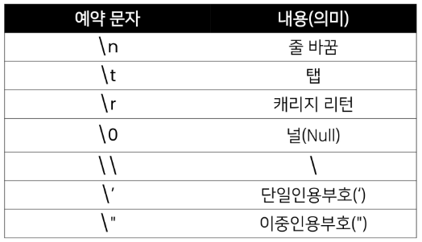
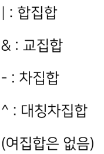

# Python basic
## OOP(Object Oriented Programming)
## code style guide
- [PEP8](https://peps.python.org/pep-0008/)
- [Google Style guide](https://google.github.io/styleguide/pyguide.html)
> Space sensitve (four spacebar)
## Datatype
### Boolean Type
- True/False
- not>and>or
### Numeric Typle
- Int/Float/Complex
- immutable
- in Float type : floating point
```python
print(3.2-3.1) != print(1.2-1.1)
```
> cuz, computer computing with using binary
> need to use epsilon or math module
### String Type
- immutable
- Escape sequence 

- String Interpolation
```python
name = 'Kim'
score = 4.5
# %-floating
print('Hello, %s' % name) # Hello, Kime
print('내 성적은 %d' % score) # 내 성적은 4
print('내 성적은 %f' % score) # 내 성적은 4.500000
# str.formoat()
print('Hello, {}! 성적은 {}' .format(name,score)) #Hello, Kim! 성적은 4.5
# f-strings : python 3.6 +
print(f'Hello, {name}! 성적은 {score}') #Hello, Kim! 성적은 4.5
```
## container
- ordered vs unordered
- ordered != sorted
### List
`list_a = [], list_a=list()`
- 파이썬에서 어떠한 자료형도 저장 가능, list in list
- mutable, 수정 가능
- 순서가 있는 시퀀스로 인덱스를 통해 접근 `list[i]`
### tuple
`tuple_a=(a,b,) tuple_a=tuple()`
- immutable, 수정 불가능
- 인덱스를 통한 접근 `tuple[i]`
### Range
- `range(n)` : 0 ~ n-1  `range(n,m)` : n ~ m-1 `range(n,m,s)` : n ~ m-1 까지 s만큼 증가시키며
- 숫자의 시퀀스, 반복문과 자주 사용
### Slicing
- index와 colon을 사용하여 문자열의 특정 부분만 잘라낼 수 있음
- `list_a[1:4]` : 1,2,3에 해당하는 인덱스만
> 앞은 포함 뒤는 제외
- `'abcdefg'[1:5:2]` : index 1~4 를 2간격으로 slicing
``` python
s = 'abcdefghi'
s[2:5]  #'cde'
s[2:5:2]  #'ce'
s[5:2:-1]  #'fed'
s[:3]  #'abc'
s[5:] #'fghi'
s[::] == s[0:len(s):1] #'abcdefghi'
s[::-1] == s[-1:-((len(s))+1):-1] #'ihgfedcba'

```
### Set
- `set_a={1,2,3},set_a=set()` 단, 빈 set을 만들기 위해 set() 반드시 필요
- 중복, 순서 없는 데이터들의 묶음
- 수학에서의 집합
- mutable
- Set 연산자

### Dictionary
 - `dict_a={}, dict_a=dict()`
 - key:value 쌍으로 이루어짐
 - key는 immutable value는 mutable
 > key:[str,int,float,boolean,tuple,range]
 - `dict_a['key']`와 같은 방식으로 value에 접근
## datetime
``` python
import datetime
today - datetime.datetime.now()
print(today)
print(f'오늘은 {today:%y}년 {today:m}월 {today:%d일}')
pi=3.141592
print(f'원주율을 {pi:.3}, 반지름이 2일 때 원의 넓이는 {pi*2*2})
```