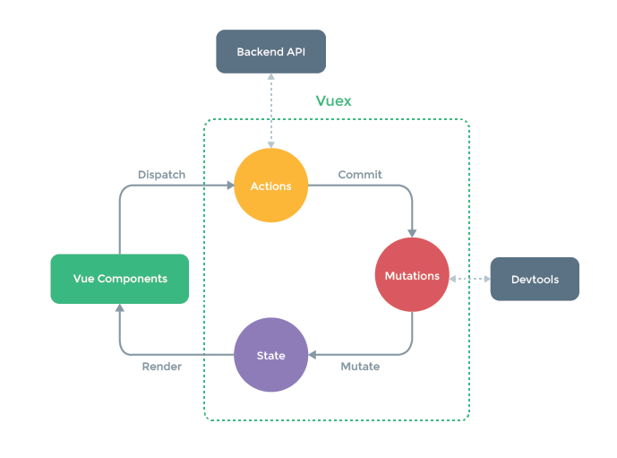
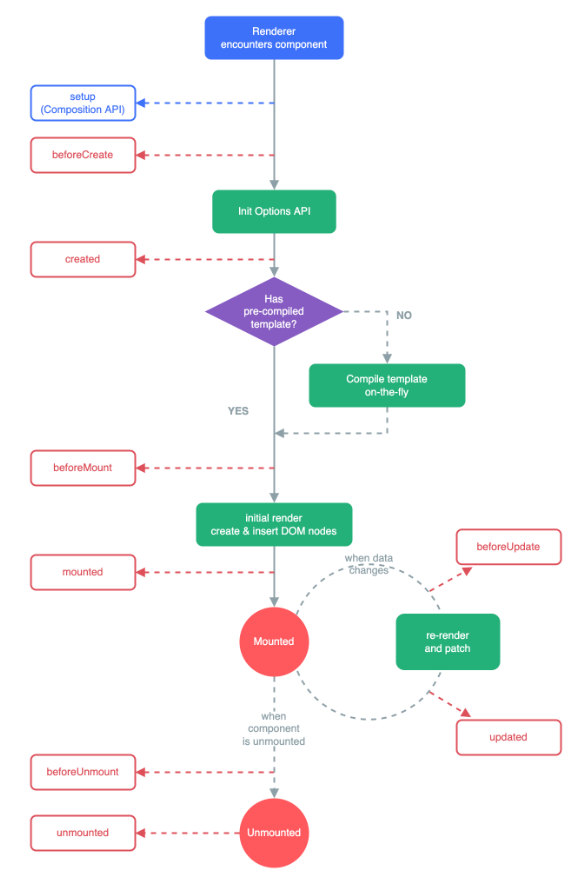

# Vuex

## State Management

* 다양한 component가 조합되어 하나의 App
* 각 component는 독립적이기 때문에 각각의 data를 가짐
* 여러개의 component가 같은 data를 유지해야 할 때 필요한 것이 state Management


|              Pass Props&Emit Event               |                                              Centralized Store                                              |
| :----------------------------------------------: | :---------------------------------------------------------------------------------------------------------: |
|      * 각 컴포넌트는 독립적으로 데이터 관리      |                                     *중앙저장소에 데이터를 모아서 관리                                      |
|   * 같은 데이터를 공유하므로 동일한 상태 유지    | *중앙 저장소의 데이터가 변경되면 각각의 component는 해당 데이터의 변화에 반응하여 새로 변경된 데이터를 반영 |
| * component의 중첩이 깊어지면 데이터 전달이 복잡 |                                규모가 크거나, 컴포넌트 중첩이 깊은 프로젝트                                 |


## What is Vuex


* Vue에서 State Management를 쉽게 할 수 있도록, 도와주는 Library

```js
import Vue from 'vue'
import Vuex from 'vuex'

Vue.use(Vuex)

export defalut new Vuex.Store({
    state: {
        
        },
    getters: {
        
        },
    mutations: {
        
        },
    actions: {
        
        },
    modules: {
        
        }

})

```

1. state

* Vue에서의 data
* store에서 관리하는 모든 data에 대한 정보

2. mutations

* state를 변경하는 유일한 방법
* 반드시 sync function을 사용해야함 : async func을 통해 state를 변경하는 경우, state의 변화시기를 특정할 수 없음
* first args 는 state이며, components 혹은 Actions에서 commit()으로 호출

3. actions

* async func 사용가능 => 외부 API와의 소통
* state를 변경하는 것을 불가능 => commit()을 통해 mutations를 호출 후 변경
* first args = context, components에서 dispatch()를 통해 호출

1. getters

* components의 computed와 유사: state를 활용하여 값을 계산하고자 할 때
* first arg = state, 2nd arg = getter



### How to controll data in components with Vuex
> component => (actions) => mutaions => state

### How to use data in components with Vuex
> state => (getters) => component

## Lifecycle Hooks

* Vue의 각 instance는 Create, Mount, Update, Delete 중 단계별 initialize를 진행
* 각 단계가 trigger가 되어 특정 로직을 실행 가능
* 이를 Lifecycle Hooks라고 함



## Vuex syntax

[Vuex Documents](https://vuex.vuejs.org/)