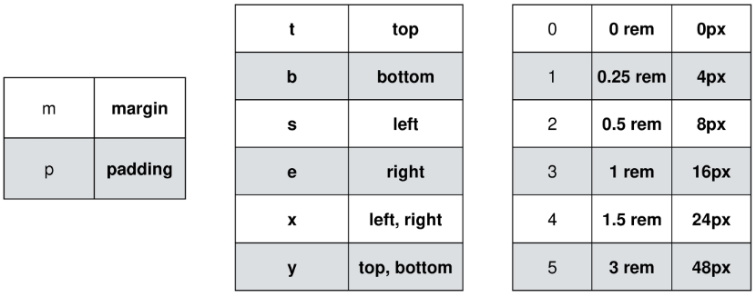
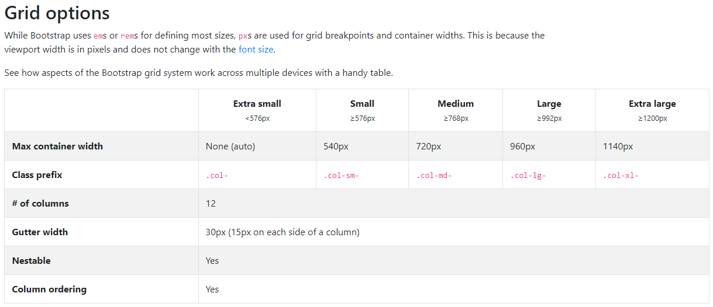

# Bootstrap

## 1. CDN(Content Delivery(Distrubution) Network)

- contents를 효율적으로 전달하기 위해 여러 노드에 가진 네트워크에 데이터를 제공하는 시스템
- 개별 end-user에 가까운 서버를 통해 빠르게 전달 가능
- 외부 서버를 활용함으로써 본인 서버의 부하가 적어짐

## 2. spacing

## 3. Responsive web

- 다양한 화면 크기를 가진 디바이스들이 등장함에 따라 responsive web design이 필요
- Media Queries, Flexbox, Bootstrap Grid system, The viewport meta tag를 포함

## 4. Bootstrap Grid System

- column : 실제 컨텐츠를 포함하는 부분, 하나의 column은 12칸
- Gutter : 칼럼과 칼럼 사이의 공간(사이 간격)
- Container : Column들을 담고 있는 공간

