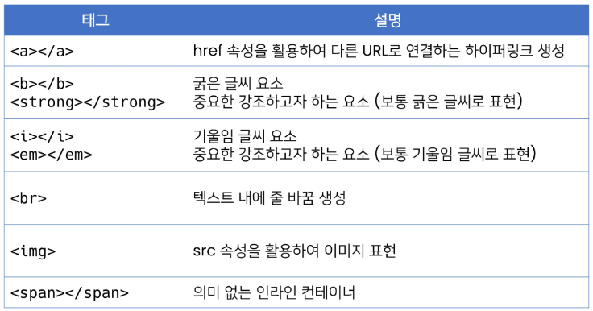
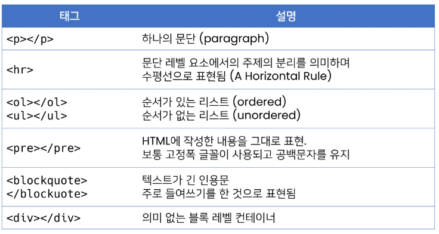
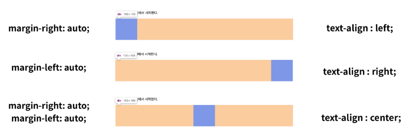

# Web기본

- 경험적, 시각적 요소가 중요, 다른 웹페이지를 뜯어보거나 많은 코딩을 통해 확인

## 웹사이트의 구성요소

- HTML : 구조 CSS : 표현 Javascript : 동작

## 웹 표준과 크로스 브라우징

- 브라우저마다 동작이 달라서 문제가 생김(파편화) => 해결책으로 웹 표준이 등장
- 어떤 브라우저든 웹페이지가 동일하게 보이도록(크로스 브라우징)
- WHATWG,W3C
- [CanIuse](https://caniuse.com)

## Static vs Dynamic

- static: 같은 상황에서 모든 사용자에게 동일한 정보 표시
- dynamic: 사용자의 요청에 따라 웹페이지를 변경

## HTML

- Hyper Text Markup Language
- 웹페이지를 작성하기 위한 언어 .html

## Hyper Text(이론)

- Hyper link를 통해 user가 다른 문서로 즉시 접근할 수 있는 Text

## HTML 스타일 가이드

```html
<body>
    <h1> 웹문서 </h1>
    <ul>
        <li>HTML</li>
        <li>CSS</li>
    </ul>
</body>
```

## HTML 기본구조

- html : 문서의 최상위(root)요소
- head : 문서 메타데이터 요소

> `<title><meta><link><script><style>`

- 문서 제목, 인코딩, 스타일, 외부파일로딩
- 브라우저에 일반적으로 나타나지 않음
- body

### 요소 (element)

- html 요소는 시작태그와 종료 태그 그리고 태그 사이에 위치한 내용으로 구성
`<h1>contents</h1>`
- 내용이 없는 태그(닫는 태그가 없는 태그도 존재)

#### attribute(속성)

`<a href="https://google.com"></a>`

- 태그별로 사용할 수 있는 속성이 다르다.
- 공백 X 쌍따옴표 사용

> HTML Global Attribute

- 모든 HTML요소가 공통으로 사용
id , class, data-*, style, title, tabindex

### HTML 문서 구조화

- 인라인/블럭 요소로 나뉨





- 인라인 요소는 글자처럼, 블록요소는 한 줄 모두 사용

## CSS

```css
    h1{
        color: blue;
        font-size: 15px
    }
```

- h1 = 선택자(selector), color:blue = 선언(declaration), font-size = 속성(property), 15px = 값(value)
- 선택자를 통해 스타일을 지정할 HTML 요소를 선택
- 중괄호 안에서는 속성과 값, 하나의 쌍으로 이루어진 선언을 진행
- 각 쌍은 선택한 요소의 속성, 값을 의미

### CSS 정의 방법

- inline: 해당 태그에 직접 style 적용, 실수가 잦아져서 활용도 낮음
- style tag(내부참조): 코드가 길어짐
- link file(외부참조): 가장 많이 쓰는 방식

### CSS Selctors

- 기본선택자
  - 전체 선택자, 요소선택자
  - 클래스 선택자, 아이디 선택자, 속성 선택자
- 결합자(Combinators)
  - 자손 결합자, 자식 결합자
  - 일반 형제 결합자, 인접 형제 결합자
- 의사/클래스 요소(Pseudo Class)
  - 링크, 동적 의사 클래스
  - 구조적 의사 클래스, 의사 엘리먼트, 속성 선택자

```css
/*전체 선택자*/
*{
    color: red;
}
/*요소 선택자 */
h2 {
    color: orange;
}
h3,h4{
    font-size: 10px;
}
/*클래스 선택자*/
.green{
    color: purple;
}
/*id 선택자*/
#purple{
    color: purple;
}
/*자식 결합자*/
.box > p{
    font-size: 30px;
}
/*자손 결합자*/
.box p{
    color: blue;
}
```

- 요소선택자 : HTML 태그를 직접 선택
- 클래스 선택자 : 마침표문자로 시작하며, 해당클래스가 적용된 항목을 선택
- id 선택자 : #문자로 시작하며, 해당아이디가 적용된 항목을 선택, 일반적으로 하나의 문서에 단일 아이디 사용
**cascading order**
- !important
- 인라인>id>class,속성,pseudo-class>요쇼,peseudo-element
- css 파일 로딩 순서 (밑에서 위로)
**css 상속**
- text관련 요소는 상속됨
- box, position  관련 요소는 상속되지 않음
**결합자(Combinators)**
- 자손결합자(space) : selectorA 하위의 모든 selectorB 요소
- 자식결합자(>) : selectorA 바로 아래의 selectorB 요소
- 일반 형제 결합자(~) : selectorA의 형제 요소 중 뒤에 위치하는 selectorB 요소를 모두 선택
- 인접 형제 결합자(+) : selectorA의 형제 요소 중 바로 뒤에 위치하는 selectorB 요소를 선택

### CSS 기본 스타일

- px : 픽셀, 고정적
- % : 백분율, 가변적 레이아웃
- em : 부모요소의 상속영향, 상대적
- rem : 상속 영향 X, 최상위 사이즈 기준
**viweport**
- 디바이스의 크기
- vw,vh,vmin,vmax 등을 사용



### CSS position

1. relative : 상대위치

- 자기 자신의 sttic 위치를 기준으로
- 레이아웃에서 요소가 차지하는 공간은 static 일때와 동일

2. absolute : 절대위치

- 레이아웃에서 공간을 차지하지 않음
- static이 아닌 부조/조상 요소 기준 부모위치/없으면 `<body>` 위치기준
- 보통 부모는 relative 자식은 absolute

3. fixed : 고정 위치

- 레이아웃에 공간을 차지하지 않음
- 부모 요소와 관계없이 viewport를 기준으로 이동

4. sticky : 스크롤에 따라 static->fixed로 변경

### CSS layout techniques

- Display
- Position
- Float
- Flexbox
- Grid
- Responsive Web Design, Media Queries
