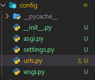

# django

- web framework
- dynamic web page를 만들 수 있게 도와줌
- web은 client-server 구조를 기반으로 동작: client는 sever에 requests를 보내고, server는 client에게 response를 준다.


> google에 접속한다는 것은
> 1. client는 구글 server에 google.html을 달라고 request
> 2. 구글 server는 request를 받아 google.html을 인터넷을 통해 reponse
> 3. 브라우저가 google.html을 우리가 볼 수 있도록 해석(rendering)

##  MTV Design pattern

- Design Pattern : 공통적인 설계에 대한 해결책을 구조화 해둔 것

### MTV Pattern, MVC

- MVC 기반으로 조금 변형된 패턴
- MVC는 Model - View - Controller: 데이터 및 논리 제어를 구현하는데 사용되는 소프트웨어 디자인 패턴
- 업무의 분리와 향상된 관리 제공
- 독립적인 개발을 통해, 개발 효율성 및 유지보수 평이화, 다수의 멤버로 개발하기 용이
- Model : 데이터와 관련된 로직 관리
- View : 레이아웃과 화면 처리
- Controller : 명령을 model과 view부분으로 연결

| MVC | MTV |
| ----------- | ----------- |
| Model | Model |
| View | Template |
| Controller| View |

- 두 패턴은 서로 크게 다른 점은 없으며 일부 역할에 대해 부르는 이름 다름


## Django start

```
python -m venv venv
source venv/script/activate
pip install django==3.2
pip freeze > requirements.txt
django-admin startproject config .
python manage.py runserver 
```

- terminal 안에서
- venv를 통해 가상환경생성
- 가상환경실행
- 장고 버젼 설치
- freeze를 통해 package 목록 생성
- 프로젝트 생성
> project 이름에는 python 이나 django에서 사용 중인 키워드 및 - 사용 불가
> '.'을 붙이지 않을 경우 현재 디렉토리에 프로젝트 디렉토리를 새로 생성
- 서버 실행

### structure of project



- `__init.py__`: python에 해당 directory를 하나의 python package로 다루도록 지시
- `asgi.py`: Asynchronous Server Gateway, Django application이 비동기식 웹 서버와 연결 및 소통하는 것을 도움, 배포시에 사용
- `settings.py`: Django project 설정을 관리, application 목록 관리
- `urls.py`: 사이트의 url과 적절한 views의 연결을 지정
- `wsgi.py`: Web Sever Gateway Interface, Django application이 웹서버와 연결 및 소통하는 것을 도움, 배포 시에 사용 
- `manage.py`: Django 프로젝트와 다양한 방법으로 상호작용하는 커맨드라인 유틸리티 `python manage.py <command> [options]`

## Project & Application

- Project
> collection of apps
> 프로젝트는 앱의 집합
> 프로젝트에는 여러 앱이 포함 될 수 있음
> 앱은 여러 프로젝트에 있을 수 있음
- Application
> 앱은 실제 요청을 처리하고 페이지를 보여주는 등의 역할을 담당
> 일반적으로 앱은 하나의 역할 및 기능 단위로 작성하는 것을 권장
  
## Django Application

```
python manage.py startapp articles
```

### structure of Django Application


- Application을 추가한 이후, settings.py의 INSTALLED_APPS 리스트에 반드시 추가해야 함

- `admin.py`: 관리자용 페이지 설정
- `apps.py`: 앱의 정보 작성, 별도로 추가 코드를 작성하지 않음
- `models.py`: 어플리케이션에서 사용하는 model을 정의, MTV 중 M
- `tests.py`: project의 테스트 코드
- `views.py`: view함수들이 정의 되는 곳, MTV 중 V

## Request & Response

- URL -> VIEW -> TEMPLATE 순으로 코드 작성
- Template file의 기본 경로는 
> app_name/templates/new.html
```python
# urls.py
from django.contrib import admin
from django.urls import path
from articles import views

urlpatterns = [
    path('admin/', admin.site.urls),
    #함수는 호출 되는 것이 아닌, 함수의 이름만 전달
    path('index/', views.index),
    # python 은 1급 객체
    
    #1. 함수를 변수에 저장할 수 있다.
    #2. 함수를 리턴으로 전달
    #3. 함수를 인자로 전달
    path('hello', views.hello)
```

```python
#articles/views.py

from django.shortcuts import render

# Create your views here.
# 반드시 첫 인자로 request를 받아야함
# 사용자의 요청 정보가 request에 들어있음
def index(request):
    # dictionary
    context = {
        'ssafy': 'Hello SSAFY!',
        'age': 20,
        'lunch':['라멘','갈치조림'],
    }
    return render(request, 'index.html', context)
    # render(request, template_name, context)
    '''
    request : 응답을 생성하는 데 사용되는 요청 객체
    template_name: 템플릿의 전체 이름 또는 템플릿 이름의 경로
    context: 템플릿에서 사용할 데이터
    '''
def hello(request):
    return render(request, 'hello.html')

```

```html
<!-- articles/templates/index.html -->

<!DOCTYPE html>
<html lang="en">
<head>
    <meta charset="UTF-8">
    <meta http-equiv="X-UA-Compatible" content="IE=edge">
    <meta name="viewport" content="width=device-width, initial-scale=1.0">
    <title>Document</title>
</head>
<body>
    <h1>안녕하세요 여기는 장고</h1>
    <!--  Django Template Launguage (DTL) -->
    {{ssafy}}
    <p>{{age}}</p>
    <div>{{lunch}}</div>
</body>
</html>
```

## Django Template

- 데이터 표현을 제어하는 도구이자 표현에 관련된 로직
- Django Template를 이용한 HTML 정적 부분과 동적 컨텐츠 삽입

### Django Template Language(DTL)

- Django Template 에서 사용하는 built-in template system
- 조건, 반복, 변수 치환, 필터 등의 기능
- python 코드가 아닌 프레젠테이션을 표현하기 위한 것

### DTL Syntax

1. Variable

`{{variable}}` 

변수명은 영어,숫자,_ 의 조합, 밑줄로는 시작 할 수 없음
.을 사용하여 변수 속성에 접근
render의 세번째 인자로 {'key':value}와 같이 딕셔너리 형태로 넘겨주며, 여기서 정의한 key에 해당하는 문자열이 template에서 사용 가능한 변수명

2. Filters

`{{variable|filter}}` 
표시할 변수를 수정할 때 사용

3. Tags

``
출력 텍스트를 만들거나, 반복 또는 논리를 수행하여 제어 흐름을 만듬
``

## Template inheritance

- 코드의 재사용성을 위해
- skeleton Template 사용
- 하위 템플릿에 ``: 자식템플릿이 부모 템플릿을 확장
- ` { % endblock content % }`
- 최상단의 template에 위치하기 위해


```python
# settings.py
'DIRS' : [BASE_DIR/'templates']
```

## Sending and Retrieving form data

- 웹은 클라이언트 - 서버 아키텍처 사용


### HTML `<form>` element

- 데이터가 전송되는 방법을 정의
- 웹에서 정보를 입력하는 방식(text, button, submit)을 제공하고, 사용자로부터 할당된 데이터를 서버로 전송하는 역할
- `action="{ url 'app_name:oneofurls'}", method ="GET or POST"`
- action
  - 입력데이터가 전송될 URL을 지정
  - 데이터를 어디로 보낼 것 인지 지정, 반드시 유효한 URL
  - 지정하지 않으면 form이 있는 페이지의 URL
- method
  - 데이터를 어떻게 보낼것인지
  - HTTP request methods를 지정
  - HTML form 데이터는 GET or POST만으로 전송 가능
  - GET: READ, POST:CREATE,UPDATE,DELETE
  - POST를 통해 전달할 경우 form 태그 내부에 CSRF tokken 필요
  - GET의 경우 입력데이터를 URL을 통해 전달
  - Query String Parameters
  - https://host:post/path?key=value&key=value

### HTML `<input>` element

- 사용자로부터 데이터를 입력
- "type"에 따라 동작 방식이 달라짐, MDN 참고, 기본은 'text'
- "name"
> form을 통해 제출 했을 때 파라미터의 key

## Variable routing

- url 주소를 변수로 사용
- url 일부를 변수로 지정하여 view 함수의 인자로 할당
- 변수 값에 따라 하나의 path()에 여러 페이지를 연결
- ` path(hello/<variables>, views.hello)`와 같은 형태로 정의
- 정의한 이름과, view함수에서 인자로 사용하는 값은 같아야함

## Model

- Django에서 데이터를 구조화하고 조작하기 위한 모델
- 각각의 모델은 하나의 데이터베이스 테이블에 매핑(mapping)

### Migration

- 모델을 통해 정의한 데이터를 db에 옮기는 법
- `python manage.py makemigrations`
- `python manage.py migrate`

### ORM(Object-Relational-Mapping)

- 객체 지향 프로그래밍 언어를 사용하여 호환되지 않는 유형의 시스템 간에 데이터를 변환하는 프로그래밍 기술
- python 과 SQL 사이의 번역을 담당

### QuerySet API

- Database API
  - Django가 ORM을 제공함에 따라 DB를 조작하는 방법을 제공


## CRUD

- Create/Read/Update/Delete
- 대부분의 컴퓨터 소프트웨어가 가지는 기본적인 데이터 처리기능 4가지

### CREATE

```python
#1
article = Article()
article.title = 'first'
article.content = 'iloveyou'
article.save()
#2
article = Article(title='second', content='iloveyou')
article.save()
#3 use Queryset API
#따로 인스턴스를 만들 필요가 없다.
Article.objects.create(title='third', content='iluvu')
```

### READ

```python
#all()
articles = Article.objects.all()
#get()
# 고유성을 보장하는 조회, id, pk를 사용
article = Article.objects.get(pk=1)
# filter()
# Field lookup에 대한 공식문서 참조
```
```django
<!-- all() -->

{{article.title}}

```

### UPDATE

```python
article = Article.objects.get(pk=1)
article.title = 'byebye'
article.save()
```

### DELETE
```python
article = Article.objects.get(pk=1)
article.delete()
```

## ADMIN

- `python manage.py createsuperuser`: 를 통해 admin 계정 생성
- 모델을 admin에 등록
- 
```python
# articles/admin.py
from django.contrib import admin
from . import models
admin.site.register(models.Article)
```

## Form

## ModelForm