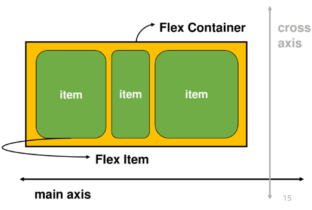
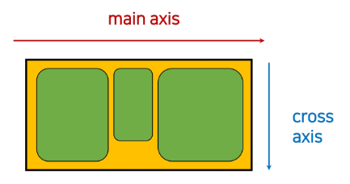
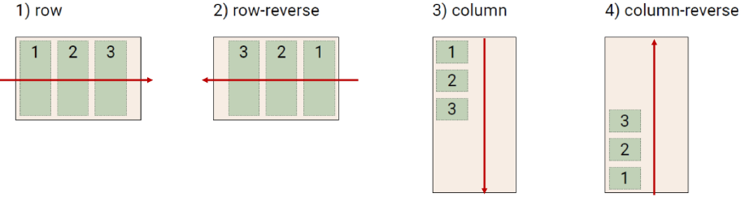
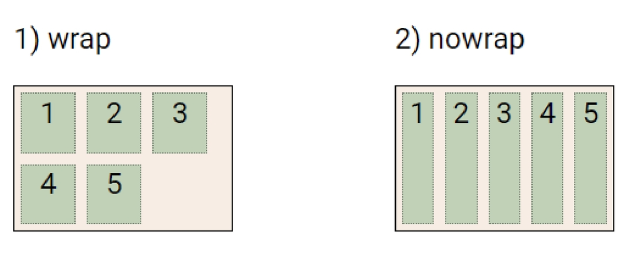
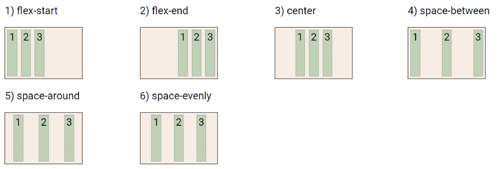
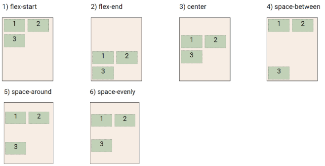

# Flexible box & Grid

## 1. Float

- 클래스 내부에서 `float.left,float.right`등으로 쓸수 있으나 요즘은 거의 안쓰임

## 2.Flexbox

### flex:direction

- 수직정렬/아이템 간의 너비 간격 동일배치 용이
- `display:flex`부모요소에 입력하면 자손요소들이 flexbox에 들어감

- Main axis의 기준방향 설정
- 꼬치에 고기 끼운다고 생각

### flex:wrep

- 아이템이 컨테이너를 벗어나는 경우 해당 영역내에 배치되도록 설정

### justify-content vs align-content

- flex-start(기본 값): 아이템들을 axis 시작점으로
- flex-end: 아이템들을 axis 끝 쪽으로
- center: 아이템들을 axis 중앙으로
- space-between: 아이템 사잉의 간격을 균일하게 분배
- space-around: 아이템을 둘러싼 영역을 균일하게 분배(가질 수 있는 영역을 반으로 나눠서 양쪽에)
- space-evenly: 전체 영역에서 아이템 간 간격을 균일하게 분배

1. justiyfy-content

- main axis를 기준으로 공간배분

2. align-items

- cross axis를 기준으로 공간 배분(아이템이 한 줄로 배치되는 경우 확인할 수 없음)

3. align-self

- 개별 아이템을 Cross axis 기준으로 정렬

`justify contents`: 메인 축을 기준으로
`align content` : 메인 축과 수직을 기준으로
bootstapt cdn을 활용하여 다양한 스타일을 사용가능
