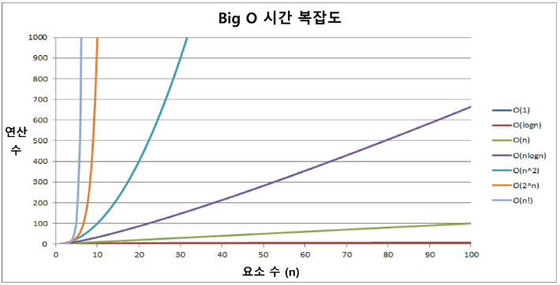

# APS

## 시간복잡도(Time Complexity)

    - 실제 걸리는 시간을 측정
    - 실행되는 명령뭉의 개수를 계산

``` python
# sum의 방법
def calsum(n): # 2n+1
    sum = 0
    for i in range(1,n+1):
        sum += i
    return sum
def calsum2(n): # 3번
    return n*(n+1)//2
```

### big-O Notation

    - 시간 복잡도 함수 중에서 가장 큰 영향력을 주는 n에 대한 항만을 표시
    
    

## 알고리즘의 우선순위

    1. 정확성 : 얼마나 정확하게 동작
    2. 작업량 : 얼마나 적은 연산으로 원하는 결과
    3. 메모리 사용량 : 얼마나 적은 메모리
    4. 단순성 : 얼마나 단순
    5. 최적성 : 더 이상 개선할 여지가 없는가
