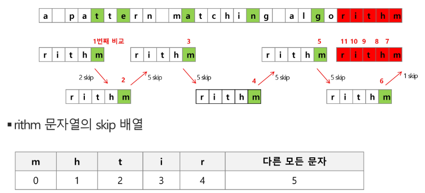

# String

- 문자열
- 패턴매칭
- 문자열 암호화
- 문자열 압축

## string in python

- 시퀀스 => 인덱싱, 슬라이싱 사용가능
- immutable

## 패턴매칭

-  Brute Force
-  카프-라빈
-  KMP
-  보이어-무어

### Brute Force

- 완전탐색
- 처음부터 끝까지 차례대로 순회하며 모든 문자들을 일일이 비교
- 시간복잡도 O(MN)

```python
p = 'is'
t = 'This is a book~!'
M = len(p)
N = len(t)
def bruteforce(p,t):
    i = 0 #t의 인덱스
    j = 0 #p의 인덱스
    while j < M and i < N:
        if t[i] != p[j]: #다른 경우
            i = i-j
            j = -1
        i = i + 1 # 일단 증가
        j = j + 1
    if j == M: return i-M # 검색성공
    else : return -1 #검색실패
```

### KMP

- 불일치가 발생한 부분에 대해 다시 비교하지 않고 매칭을 수행
- 추가적인 배열이 필요함(어느 부분까지 일치, 불일치를 판별하기 위함)
- pre process 중요함 `'abcdabcef' => [-1,0,0,0,0,1,2,3,0]`

```python
def pre_process(pattern):
    # 전처리를 위한 테이블 (LPS table longest prefix suffix)
    lps = [0] * len(pattern)
    j = 0  # lps를 만들기 위한 prefix index
    for i in range(1, len(pattern)): # index 0는 확인할 필요 없음

        # prefix index 위치에 있는 문자와 비교
        if pattern[i] == pattern[j]:  # 제일 앞과 i번째 앞의 위치와 비교
            lps[i] = j + 1
            j = j + 1  # j는 중복된 글자의 자리
        else:
            j = 0
            # 0으로 이동한 다음 prefix idx비교 를 한번 더 해야함 ex)abaab [0,0,1,1,2]
            if pattern[i] == pattern[j]:
                lps[i] = j + 1
                j = j + 1
    return lps

def kmp(text, pattern):
    lps = pre_process(pattern)  # 전처리로 lps 생성
    i = 0
    j = 0
    while i < len(text):  # i는 text j는 pattern
        if pattern[j] == text[i]:  # 같은 문자라면 다음꺼 비교
            i += 1
            j += 1
        else:
            if j != 0:
                j = lps[j - 1]
            else:
                i += 1

        if j == len(pattern):
            return i - j

    return -1
```

### boyer-mooer



- 패턴의 오른쪽 끝에 있는 문자가 불일치 하고, 문자가 패턴 내에 존재하지 않는 경우, 이동 거리는 패턴의 길이

```python
def skip_table(pattern):
    M = len(pattern)  # 패턴의 길이

    table = dict()
    for i in range(M-1): # 마지막 자리는 패턴을 통해 비교하여 자리를 바꾸기 때문에 굳이 계산하지 않아도 됨
        table[pattern[i]] = M - i - 1

    return table

def boyermooer(text,pattern):
    skip_table1 = skip_table(pattern)
    M = len(pattern)

    i = 0  #text index
    while i <= len(text) - M:
        j = M - 1  # 뒤에서 부터 비교
        k = i + (M-1)  # 비교를 시작할 위치 (현재위치 + M번째 index)

        while j >= 0 and pattern[j] == text[k]:  # 비교할 j 가 남아있고, text와 pattern이 일치한다면 그 다음 앞의 글자를 비교하기 위해
            j -= 1
            k -= 1

        if j == -1:  # 찾았다.
            return i

        else:
            # 일치 하지 않는다면 i를 비교 시작할 위치를 skip table에서 가져온다.
            i += skip_table1.get(text[k], M)

    return -1
```