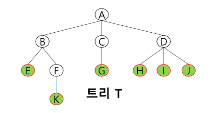
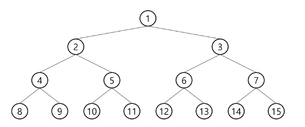
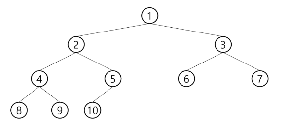
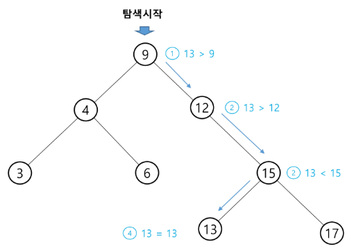
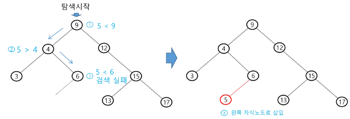

# Tree


- 한 개 이상의 노드로 이루어진 유한 집합
  
  - 최상위 노드를 루트
  
  - 나머지 노드 들은 n 개의 집합으로 분리 될 수 있고, 이들은 루트의 부 트리(subtree)라 한다.



- node : elements of tree
  
  - A, B, C, D, E, F, G, H, I,  J, K

- edge: 노드를 연결하는 선, 노드의 개수 -1

- root node: 트리의 시작 노드

- 차수(degree)
  
  - degree of node :  노드에 연결된 자식 노드의 수
    
    - B:2, C:1
  
  - degree of tree : 트리에 있는 차수 중에서 가장 큰 값
    
    - degree of tree : 3
  
  - leafnode: 차수가 0인 노드, 자식 노드가 없는 노드


## 이진트리


- 모든 노드들이 2개의 서브트리를 갖는 특별한 형태의 트리

- 각 노드가 자식 노드를 최대한 2개 까지만 가질 수 있는 트리

- 레벨 i에서 노드의 최대 개수는 2^i 개

- 높이가 h인 이진 트리가 가질 수 있는 노드의 최소 개수는 h+1, 최대 개수는 2^h -1


### 포화 이진 트리 (Full Binary Tree)


- 모든 레벨에 노드가 포화상태로 차 있는 이진 트리

- 높이가 h일 때, 최대 노드 개수 2^h -1의 노드를 가진 이진 트리





### 완전 이진 트리 (Complete Binary Tree)

높이가 h이고 노드 수가 n개일 때, 포화 이진 트리의 노드 번호 1번부터 n번까지 빈 자리가 없는 이진 트리





### 편향 이진 트리(Skewed Binary Tree)

높이 h에 대한 최소 개수의 노드를 가지면서 한쪽 방향의 자식 노드만을 가진 이진 트리


### 순회(traversal)


- 트리의 각 노드를 중복되지 않게 정부 방문 하는 것, 비 선형 구조 이므로 다른 방법이 필요

- 전위순회(preorder traversal): 부모노드 방문 후, 자식노드를 좌, 우 순서로 방문

```python
def preorder(n):
    if n:
        visit(n) # print(node[n])
        preorder(n.left)
        preorder(n.right)
```

- 중위순회(inorder traversal): 왼쪽 자식노드, 부모노드, 오른쪽 자식노드 순으로 방문

```python
def ineorder(n):
     if n:
         preorder(n.left)
         visit(n) # print(node[n])
         preorder(n.right)
```


- 후위순회(postorder traversal): 자식노드를 좌우 순서로 방문한 후 , 부모노드 방문

```python
def postorder(n):
     if n:
         preorder(n.left)
         preorder(n.right)
         visit(n) # print(node[n])
```


### 이진 탐색 트리


- 탐색작업을 효율적으로 하기 위한 자료구조

- 모든 원소는 서로 다른 유일한 키를 갖는다.

- key(왼쪽)<key(root node)<key(오른쪽)

- inorder traversal을 통해 오름차순으로 정렬된 값을 얻을 수 있다.
-

```python
def inorder(n):
	if n<=N:
		inorder(2*n)
		visit(n)
		inorder(2*n+1)
```


탐색연산



삽입연산

- 먼저 탐색 연산을 수행

- 탐색 실패한 위치에 원소 삽입



> 검색 알고리즘의 비교

- 배열에서의 순차 검색 O(N)

- 정렬된 배열에서의 이진탐색 O(logN)

- 이진 탐색트리에서의 평균 O(logN)
  
  - 최악의 경우: O(N)
  
  - 완전 이진 트리 또는 균형트리로 바꿀 수 있다면 최악의 경우를 없앨 수 있다.

- 해쉬 검색 : O(1)
  
  - 추가 저장 공간이 필요


## 힙(heap)

완전 이진 트리에 있는 토드 중에서 키 값이 가장 큰 노드나 키 값이 가장 작은 노드를 찾기 위해서 만든 자료구조


- max heap
  
  - key of parents node > key of child node
  
  - root node : 키 값이 가장 큰 노드

- min heap
  
  - key of parents node < key of child node
  
  - root node :  키 값이 가장 작은 노드
