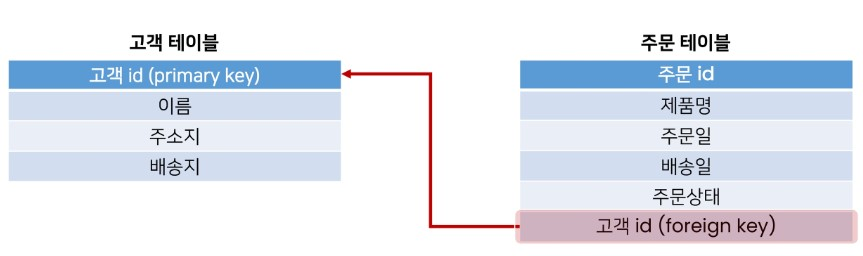
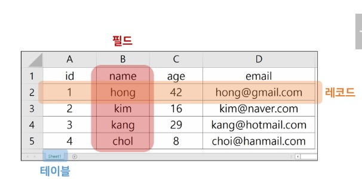

# Database

## Database

- 프로그래밍 언어를 사용해 작동
- RDB(Relational Database)라고 부르는 관계형 데이터베이스가 많음

### RDB

- Relational Database
- 데이터를 테이블, 행, 열 등으로 나누어 구조화
- 자료를 여러 테이블로 나누어서 관리하고, 테이블간 관계를 설정해 여러 데이터를 쉽게 조작
- SQL을 사용하여 데이터를 조회하고 조작
- 직관적인 데이터 표현
- 관련데이터에 쉽게 접근
- 대량의 데이터도 효율적으로 관리 가능


스키마(Schema)

- 테이블의 구조
- 데이터베이스에서 자료의 구조, 표현 방법, 관계 등 전반적인 명세를 기술한 것

|column|datatype|
|------|--------|
|  id  |   INT  |
| name |  TEXT  |
|address|  TEXT |
|age    | INT   |

테이블(Table)



1. fleld : 속성, column
2. record : 튜플, row
    - 테이블의 데이터는 record에 저장됨
3. id ~= pk(primary key)
    - 각 레코드의 고유한 값 : 각각의 데이터를 구분할 수 있는 값
    - 기술적으로 다른 항목과 절대로 중복될 수 없는 단일 값(unique)

## SQL

- Structured Query Language
- RDBMS의 데이터를 관리하기 위해 설계된 특수 목적의 프로그래밍 언어
- db schema를 생성 및 수정 가능, table에서의 자료 검색 및 관리
- db 객체에 대한 처리를 관리하거나 접근 권한을 설정하여 허가된 사용자만 RDBMS를 관리할 수 있도록 할 수 있음

### SQL Commands

1. DDL : Data Definition Language
2. DML : Data Manipulation Language
3. DCL : Data Control Language

|분류|개념|SQL 키워드|
|----|----|----|
|DDL - 데이터 정의 언어|RDB(schema, table)을 정의(생성, 삭제, 수정)하기 위한 명령어|CREATE, DROP, ALTER|
|DML - 데이터 조작 언어|데이터를 조작(추가,조회,변경,삭제)라기 위한 명령어|INSERT, SELECT, UPDATE, DELETE|
|DCL - 데이터 제어 언어|데이터의 보안, 수행제어, 사용자 권한 부여 등을 정의하기 위한 명령어|GRANT, REVOKE, COMMIT, ROLLBACK|

### SQL syntax

```sql
SELECT column_name FROM table_name;
```

- SQL 문(statement)는 SELECT, INSERT, UPDATE 등과 같은 키워드로 시작하고, 하나의 statement는 ;(semicolon)으로 끝남

### DDL

#### CREATE TABLE

```sql
CREATE TABLE table_name(
    col_1 data_type constranints,
    col_2 data_type constranints,
    col_3 data_type constranints,
);
```

- rowid
  - 테이블을 생성할 때마다 rowid라는 암시적 자동 증가 column이 자동으로 생성
  - 각 record를 고유하게 식별하는 64bit 부호 있는 INT 값
  - 테이블에 새로은 record를 삽입할 때 마다 자동할당
        - 값은 1에서 시작

- data types
    1. NULL
        - NULL value
        - 정보가 없거나 알 수 없음을 의미
    2. INTEGER
        - 정수
        - 크기에 따라 가변 바이트
    3. REAL
        - 실수
        - 8바이트 부동 소수점을 사용하는 실수
    4. TEXT
        - 문자 데이터
    5. BLOB(Binary Large Object)
        - 입력된 그대로 저장된 데이터 덩어리
        - 멀티미디어 파일
  - 대부분의 데이터베이스 엔진에서는 컬럼에 선언된 데이터 타입에 의해 저장

- constranints
  - 제약조건
  - 입력하는 자료에 대해 제약을 정함
  - 제약에 맞지 않다면 입력이 거부
  - 사용자가 원하는 조건의 데이터만을 유지하기 위해, 즉 데이터의 무결성을 유지하기 위해 보편적인 방법으로 테이블의 특정 컬럼에 설정하는 제약
  1. NOT NULL
        - 컬럼이 NULL값을 허용하이 않도록 지정
        - NOT NULL이 아닌 경우 NULL 값을 허용이 기본
  2. UNIQUE
        - column의 모든 값이 서로 구별되거나 고유한 값이 되도록 함
  3. PRIMARY KEY
        - table에서 record의 고유성을 식별하는데 사용되는 column
        - 각 table에는 하나의 기본 키만 있음
        - 암시적으로 NOT NULL 제약 조건이 포함

        ```sql
        CREATE TABLE table_name(
            id INT PRIMARY KEY,
        );
        ```

  4. AUTOINCREMENT
        - 사용되지 않은 값이나 이전에 삭제된 행의 값을 재사용 하는 것을 방지
        - `INT PRIMARY KEY` 다음에 작성하면 해당 rowid를 다시 재사용하지 못하도록 함
  5. ETC..

#### 데이터 무결성

- db 내의 data에 대한 정확성, 일관성을 보장하기 위해 데이터 변경 혹은 수정 시 여러 제한을 두어 데이터의 정확성을 보증하는 것

#### ALTER TABLE

- Modify the structure of an existing table

```sql
-- Rename a table
ALTER TABLE table_name RENAME TO new_table_name;

-- Re
```
